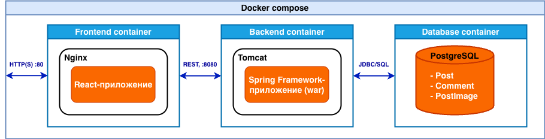

# My Blog App

[](https://github.com/Aberezhnoy1980/my-blog-app/actions/workflows/ci.yml)


Учебный full-stack проект (Yandex Practicum, Sprint 4) с акцентом на production-friendly практики:

- backend: Spring Boot, Executable JAR, embedded Tomcat, JDBC/JdbcTemplate;
- migrations: Flyway (schema + demo seed data);
- infra: Docker Compose (PostgreSQL + Spring Boot backend + Nginx);
- quality: integration tests, CI, unified API error format, AOP logging.

## Содержание

- [My Blog App](#my-blog-app)
  - [Содержание](#содержание)
  - [Быстрый старт](#быстрый-старт)
    - [Вариант 1 (рекомендуется): весь стек через Docker Compose](#вариант-1-рекомендуется-весь-стек-через-docker-compose)
    - [Вариант 2: backend локально без Docker (dev profile)](#вариант-2-backend-локально-без-docker-dev-profile)
  - [Архитектура](#архитектура)
  - [Функциональность API](#функциональность-api)
    - [Posts](#posts)
    - [Comments](#comments)
  - [Профили и конфигурация](#профили-и-конфигурация)
  - [Команды и сценарии](#команды-и-сценарии)
    - [Сборка и тесты](#сборка-и-тесты)
    - [Docker Compose](#docker-compose)
    - [Smoke checks](#smoke-checks)
  - [База данных и Flyway](#база-данных-и-flyway)
  - [Тестирование и CI](#тестирование-и-ci)
  - [Структура репозитория](#структура-репозитория)
  - [Known frontend quirks](#known-frontend-quirks)
  - [Roadmap](#roadmap)
  - [What I would improve in production](#what-i-would-improve-in-production)
  - [Contributing and License](#contributing-and-license)
  - [Документация](#документация)

## Быстрый старт

### Вариант 1 (рекомендуется): весь стек через Docker Compose

Из корня репозитория:

```bash
docker compose up --build
```

После старта:

- UI: [http://localhost](http://localhost)
- API health (через Nginx): `curl -sS http://localhost/api/health`
- API direct (Boot app): `curl -sS http://localhost:8080/api/health`

### Вариант 2: backend локально без Docker (dev profile)

Нужна локальная PostgreSQL на `localhost:5432` с БД `my_blog` и пользователем `postgres/postgres`.

```bash
./gradlew :my-blog-back-app:bootRun --args='--spring.profiles.active=dev'
```

## Архитектура



- **Frontend**: готовый React bundle из Practicum (`my-blog-front-app/dist`) за Nginx.
- **Backend**: Spring Boot (auto-configuration), layered architecture:
  - `controller` -> `service` -> `repository` -> PostgreSQL.
- **Database**: PostgreSQL в Docker и H2 для integration tests.
- **Migrations**: Flyway выполняется на старте backend.

Сетевой контракт в Compose:

- `http://localhost` (Nginx, UI)
- `http://localhost:8080` (Spring Boot app, API)
- SPA в бандле обращается к API по `http://localhost:8080/api/...`.

## Функциональность API

### Posts

- `GET /api/posts?search=...&pageNumber=...&pageSize=...`
- `POST /api/posts/{id}` (compat endpoint под контракт фронта)
- `GET /api/posts/{id}`
- `POST /api/posts`
- `PUT /api/posts/{id}`
- `DELETE /api/posts/{id}`
- `POST /api/posts/{id}/likes`
- `PUT /api/posts/{id}/image`
- `GET /api/posts/{id}/image`

### Comments

- `GET /api/posts/{postId}/comments`
- `GET /api/posts/{postId}/comments/{id}`
- `POST /api/posts/{postId}/comments`
- `PUT /api/posts/{postId}/comments/{id}`
- `DELETE /api/posts/{postId}/comments/{id}`

## Профили и конфигурация

Используются профили `dev`, `test`, `prod`.

- `application-dev.properties`:
  - `spring.datasource.url=jdbc:postgresql://localhost:5432/my_blog`
  - локальная разработка.
- `application-test.properties`:
  - H2 in-memory (`MODE=PostgreSQL`)
  - используется integration tests.
- `application-prod.properties`:
  - `spring.datasource.*` через `DB_URL`, `DB_USERNAME`, `DB_PASSWORD`.

Ключевые env vars для `prod`:

- `DB_URL`
- `DB_USERNAME`
- `DB_PASSWORD`

## Команды и сценарии

### Сборка и тесты

```bash
./gradlew check
```

```bash
./gradlew :my-blog-back-app:test
```

```bash
./gradlew :my-blog-back-app:bootJar
```

### Docker Compose

Запуск:

```bash
docker compose up --build
```

Фон:

```bash
docker compose up -d --build
```

Остановка:

```bash
docker compose down
```

Логи:

```bash
docker compose logs -f backend
```

Состояние:

```bash
docker compose ps
```

### Smoke checks

```bash
curl -sS http://localhost/api/health
curl -sS "http://localhost:8080/api/posts?search=&pageNumber=1&pageSize=5"
```

## База данных и Flyway

- Данные PostgreSQL персистятся в `./postgres-data` (bind mount).
- Каталог не коммитится (`.gitignore`).
- Flyway migrations:
  - `V1__init_schema.sql` — schema;
  - `V2__demo_seed.sql` — demo posts/comments;
  - `V3__demo_seed_more_comments.sql` — доп. demo comments;
  - `V4__Normalize_tags` (Java) — таблицы `tags` и `post_tags`, перенос из legacy CSV в `posts.tags`, затем удаление этой колонки.
- На существующей БД применяются только новые migration versions (`flyway_schema_history`).

## Тестирование и CI

- Integration tests:
  - `BlogServicesIntegrationTest`
  - `BlogControllersIntegrationTest` (MockMvc)
- CI (GitHub Actions): `./gradlew --no-daemon check` на push/PR.

## Структура репозитория

```text
.
├── build.gradle
├── settings.gradle
├── gradlew
├── gradle/wrapper/
├── my-blog-back-app/                        # backend module (Spring Boot, executable JAR)
│   ├── src/main/java/ya/practicum/blog/
│   │   ├── config/
│   │   ├── controller/
│   │   ├── service/
│   │   ├── repository/
│   │   ├── db/migration/                    # Flyway Java migrations
│   │   ├── dto/
│   │   └── model/
│   └── src/main/resources/
│       ├── db/migration/
│       ├── application-*.properties
│       └── logback*.xml
├── my-blog-front-app/                       # Practicum frontend bundle + nginx config
├── docker/backend/Dockerfile                # multi-stage build -> Boot JAR image
├── docker-compose.yml
├── docs/
└── README.md
```

## Known frontend quirks

Проект использует готовый frontend bundle из Practicum (без исходников), поэтому в backend добавлены совместимые handling-пути:

- `POST /api/posts/{id}` (detail compat);
- `GET /api/posts/undefined/comments` compatibility endpoint;
- tolerant handling для image upload/content-type;
- tolerant handling для edge-case update flow с пустыми `tags`.

Это позволяет сохранить контракт задания и стабильный UX без модификации frontend bundle.

## Roadmap

- [ ] Добавить автоматизированный smoke suite для Compose-стека (health + ключевые REST-сценарии).
- [ ] Улучшить observability: request correlation id и более структурированные логи для API.
- [ ] Добавить API contract artifact (OpenAPI/Swagger или machine-readable endpoint spec).
- [ ] Подготовить production deployment notes (reverse proxy, secrets, backup/restore, rollback strategy).

## What I would improve in production

- **Security hardening**
  - Ввести authentication/authorization для mutating endpoints.
  - Добавить rate limiting и строгую CORS policy по environment.
- **Validation and API quality**
  - Вынести DTO validation на Bean Validation (`jakarta.validation`) и унифицировать error catalog.
  - Добавить versioning strategy для API и более строгий backward-compat policy.
- **Data and reliability**
  - Добавить миграции с rollback plan и регулярный backup/restore drill.
  - Перевести image storage из DB BLOB в object storage (S3-compatible) для масштабирования.
- **Testing and delivery**
  - Расширить покрытие integration tests до negative/malformed input cases.
  - Добавить container-level integration stage в CI (test against real PostgreSQL + Boot image).

## Contributing and License

- Contribution guide: [`CONTRIBUTING.md`](CONTRIBUTING.md)
- License: [`MIT`](LICENSE)

## Документация

- Техническое задание: [`docs/technical-spec.md`](docs/technical-spec.md)
- Список требований/подготовка: [`docs/prerequisites.md`](docs/prerequisites.md)
